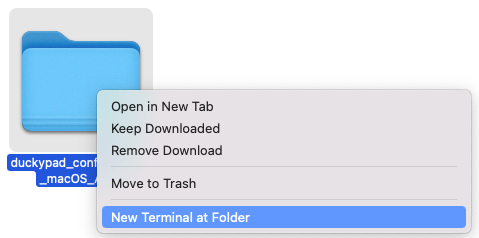
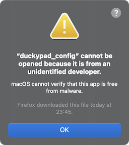
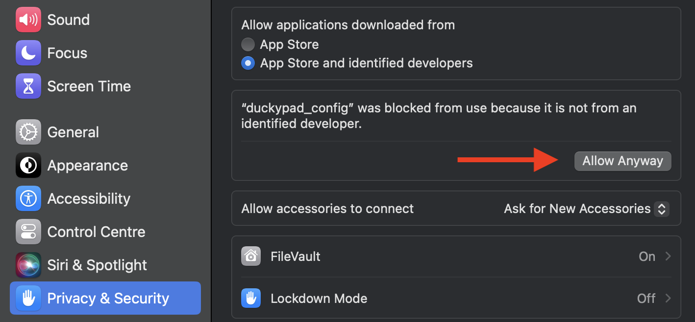

# duckyPad Configurator macOS Notes

[Get duckyPad Pro](https://www.tindie.com/products/37399/) | [Official Discord](https://discord.gg/4sJCBx5) | [Getting Started](./getting_started.md) | [Table of Contents](#table-of-contents)

---------

On macOS, you can run the configurator as a **pre-packaged app**, or execute the **source code** directly.

## Pre-packaged App

* [Download the latest macOS release here](https://github.com/dekuNukem/duckyPad-Pro/releases/latest)

* Double click to unzip

* **Right Click** on the folder, select `New Terminal at Folder`

* Type `sh ./run.sh`, press enter.

* Authenticate, then the app should launch!

---------

* If macOS complaints about unsigned app

* Go to Settings > Privacy & Security

* Scroll down to security section and click "Allow Anyway" 

## Run from Source

* [Download the latest source release here](https://github.com/dekuNukem/duckyPad-Pro/releases/latest)
* Double click to unzip
* **Right Click** on the folder, select `New Terminal at Folder`

----

* Use [homebrew](https://brew.sh) to install python-tk: `brew install python-tk`
* **[Optional]** Make a virtualenv and activate it: `python3 -m venv .venv; source .venv/bin/activate`
* Install dependencies: `pip3 install -r requirements.txt`
* Launch the app: `sudo python3 ./duckypad_config.py`
